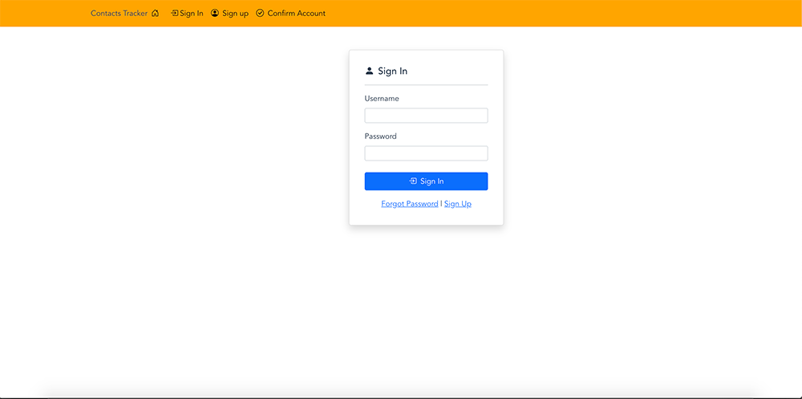

# Integrating Cognito with a web application using JavaScript SDK - Workshop

## What will be covered?

This workshop will cover how to create the following functionality in a web application using the Cognito JavaScript SDK:

### Use-Case

### Building Web Application Authentication

- Sign Up page - add user to Cognito User Pool
- Sign In page - authenticate a user stored in Cognito User Pool
- Confirm User account - confirm user after they have sign up for a new account
- Forgot Password - send user a password rest code
- Enabled MFA - enabling MFA for a users account

### Getting Data into Web App

- Learn how to send Cognito token information to an API Gateway endpoint
- Make calls to API Gateway endpoint and get data to populate in the web application.

### Web Technologies used in the workshop

In this workshop we use the Vue 3 web framework to build out our SPA (Single Page Application). You do not need to be an expert in the framework to complete the workshop. We will provide all the code needed to complete the workshop, and have commented the code to make it easier to understand.

**Note:** Having an understanding of JavaScript frameworks such as React and Angular would be benefical.

### Resource Links

- [Get more information about Vue 3](https://v3.vuejs.org/)

## Environment Setup

In order to run the workshop you will need to configure your environment. Below are the prereqs. needed.

**Note:** If your environment is already setup you can skip the steps below, and go to the **_Getting Workshop Code_** section.

#### **Installing Node**

follow the instructions for your environment here https://nodejs.org/en/download/

Validate Node was install by running the following command in your terminal or commandline:

```
node -v
```

Validate NPM was install by running the following command in your terminal or commandline:

```
npm -v
```

#### **Installing Vue 3**

You will run the following command in your terminal or commandline. This will install the latest stable version.

```
npm install vue@next
```

#### Validate Vue install

```
vue --version
```

### Environment Setup Complete

Your environment should now be setup to run all the code included in the workshop.

## Getting Workshop Code

You will next get the code to run the workshop by cloning the following Git repo. Run the following command in a preferred location on locally

place holder - public git repo will be added after code review

```
git clone ssh://git.amazon.com/pkg/Cognito-javascript-workshop
```

You can also download a zip file of the repo.

place holder - public git repo will be added after code review

### Install dependencies

Navigate to where you have cloned the code and run the below command in your terminal or commandline. This will install all the needed node modules to run the project.

```
npm install
```

### Run the project

Run the following command in your terminal or commandline to start the development server.

```
npm run serve
```

You should then see a message similar to the one below:



If you would like to stop the development server press "control+C"

### Navigating to App

Now navigate to the URL that is displayed in your terminal window where it says your **"App running at"**, and you should see the screen below.


