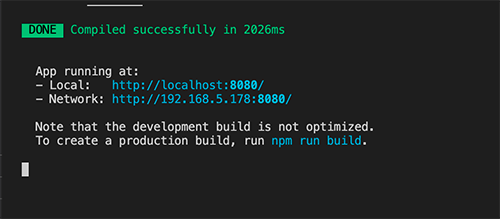
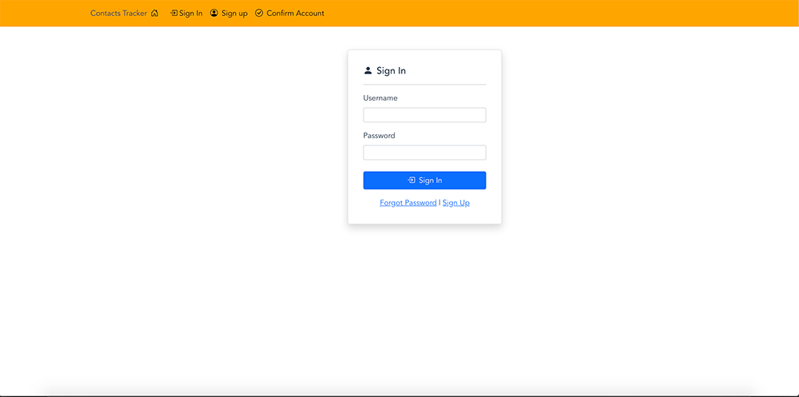

## Getting Workshop Code

You will next get the code to run the workshop by cloning the following Git repo. Run the following command in a preferred location on locally

```
git clone https://github.com/aws-samples/amazon-cognito-vue-workshop
```

You can also download a zip file of the repo here:

https://github.com/aws-samples/amazon-cognito-vue-workshop/archive/refs/heads/main.zip

### Install dependencies

Navigate to where you have cloned the code and run the below command in your terminal or commandline. This will install all the needed node modules to run the application.

```
npm install
```

### Run the project

Run the following command in your terminal or commandline to start the development server.

```
npm run serve
```

You should then see a message similar to the one below:



If you would like to stop the development server press "control+C"

### Navigating to App

Ensure you can navigate to the URL that is displayed in your terminal window where it says your **"App running at"**, and you should see the screen below.


