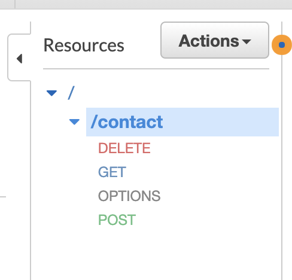
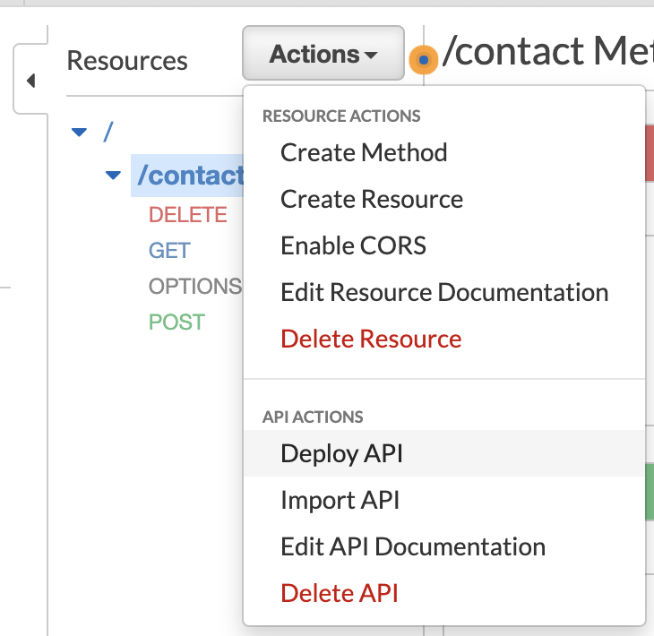
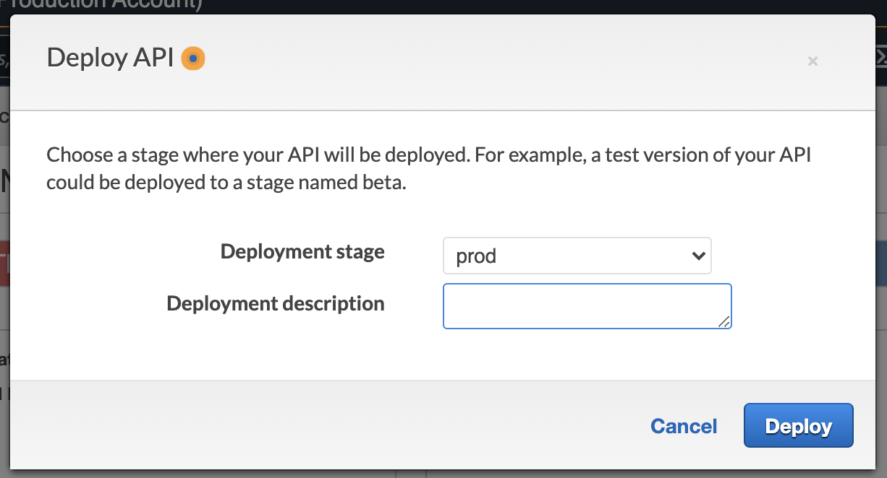
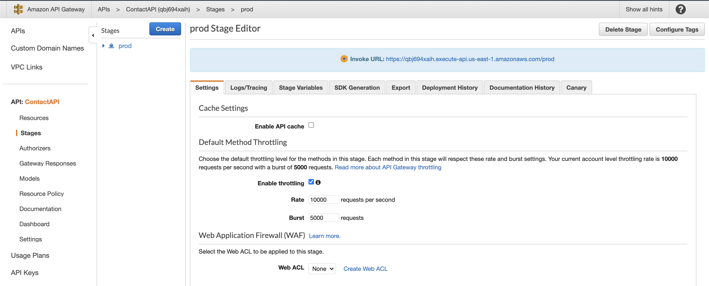

# Deploying API changes

In this section you will deploy the API that you made changes to in the previous steps.

To deploy the API select the **contact** resource. See screenshot below.



Next you will select the **Actions** drop down, and select **Deploy API**. See screenshot below.



The following dialog should appear. You will then select the **Deployment stage**, and then click the **Deploy** button.



You will then see a screen similar to the screenshot below. The **Invoke URL** will be unique to your API Gateway endpoint. Next copy the **Invoke URL** URL value and paste it in notepad. You will update your code to reference this API endpoint URL.



## Update your code to use API

The last thing to do is update your code to point to your API Gateway endpoint you deployed.

Go back to your Cloud9 code editor, and open the following file **src/store/contacts/actions.js**. Locate the following section in your source code:

### Code Snippet

```js
// Update with your API Gateway endpoint
const api = "https://your-api-gateway-endpoint-goes-here/contact/";
```

### Update Code Snippet example

```js
// Update with your API Gateway endpoint
const api =
  "https://qbj694xaih.execute-api.us-east-1.amazonaws.com/prod/contact/";
```

Be sure that you include **/contact/** after your API endpoint URL. This points top the **contact** resource on the API Gateway endpoint. After you have completed this you can restart your application if needed.

## [Test Your Application](Testing.md)
