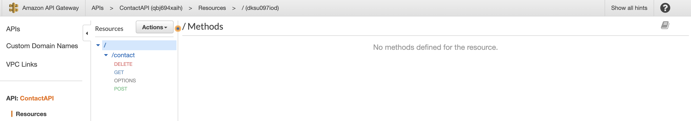
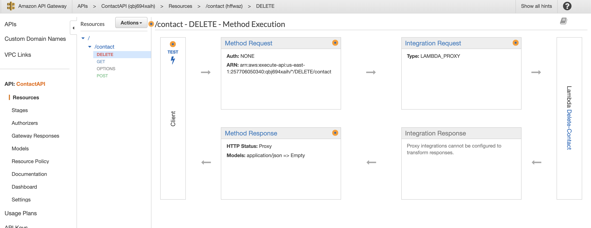
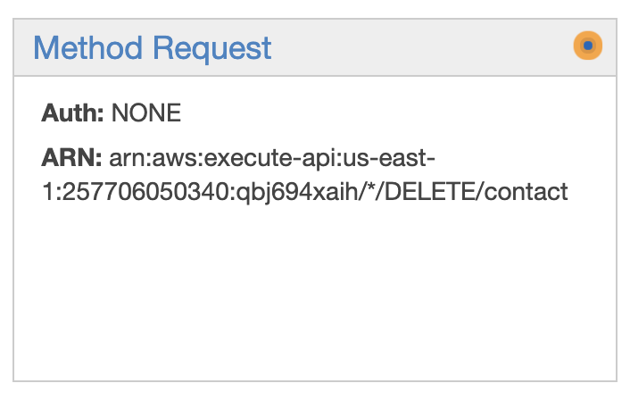
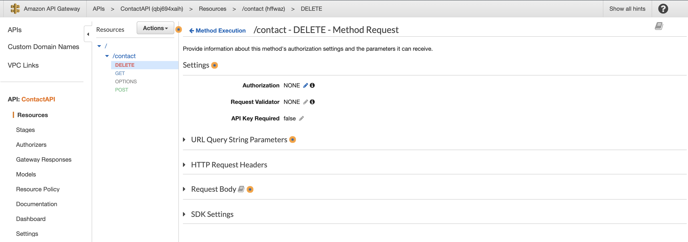

# Configuring API Gateway endpoint Authorization

In this section you walk-through how to update the API Gateway endpoints, and add Cognito authorization. This will allow your code to make calls to the API Gateway endpoints by passing the **Cognito idToken** in the **Authorization** header of the API request.

Below we will briefly walk-through a code sippet of what it looks when calling the API endpoint with a Cognito idToken.

## API Gateway request - code snippet

This code can be found in the following file **src/store/contacts/actions.js**. The code below fetches all of the contacts the user has added to their account.

```js
async fetchContacts({ commit, rootState }) {
    // creates header object to pass Cognito idToken with request to API endpoint
    const headers = {
      "Content-Type": "application/json",
      Authorization: rootState.authModule.idToken,
    };

    commit("setIsLoading", true);

    /*
    makes call to the API Gateway endpoint by passing
    api URL and header object via GET request
    */
    const response = await axios.get(api, {
      headers: headers,
    });

    /*
    if status code is 200 then data is loaded in store and
    activity spinner UI element is hidden
    */
    if (response.status == "200") {
      commit("setContacts", response.data);
      commit("setIsLoading", false);
    }
}
```

Now that you have an idea of how the code makes call to the API endpoint with the Cognito idToken you will configure the API Gateway endpoint.

## Configure API Gateway endpoints

Go back into the AWS console and search for the API Gateway service. Once you navigate the API Gateway service you should see the following screen.


Click on **ContactAPI** and you should see the following screen.



Next click on **DELETE** under the **_Resources_** panel. After you click on **DELETE** you should see the screen below.



Now you will click on the link that says **Method Request** at the top of the panel seen in the screen below.



The following screen should now appear.



Next click the pencil icon next **Authorization**, and select the name of the Cognito