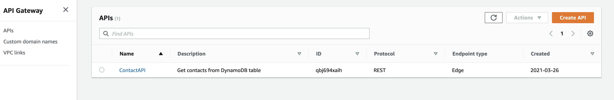
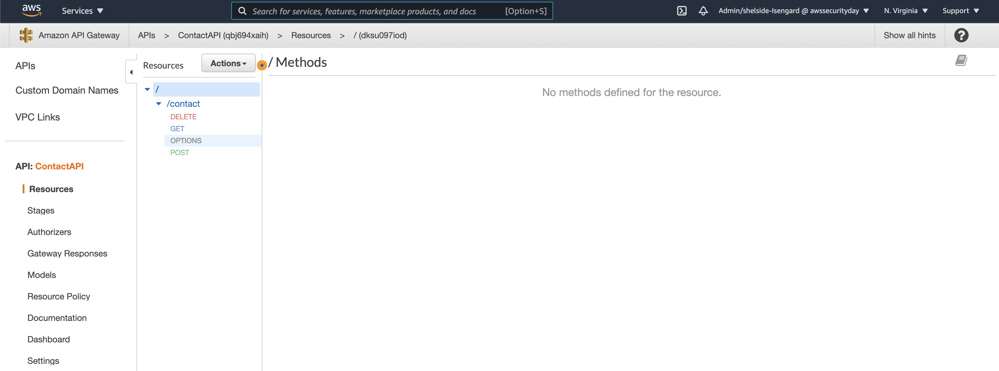
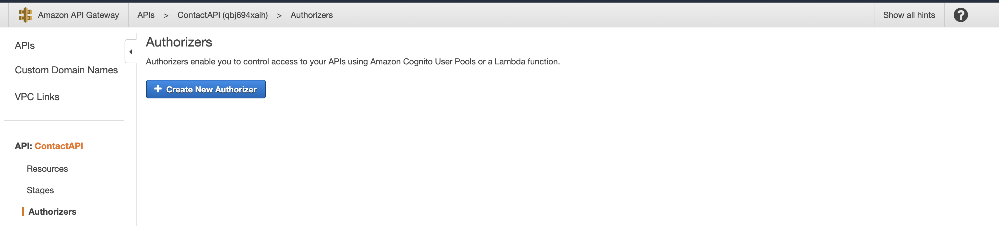
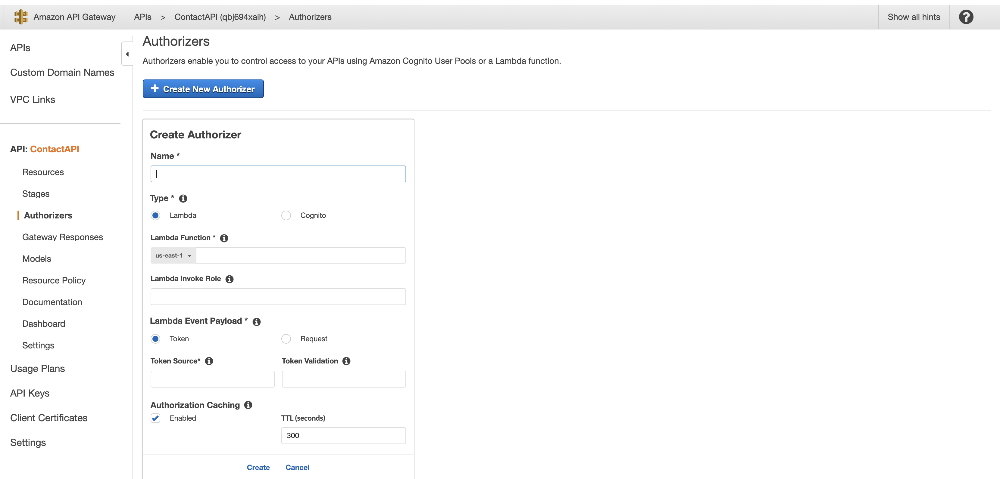
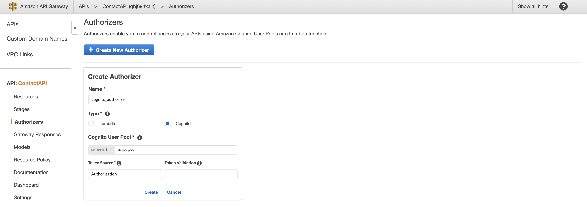
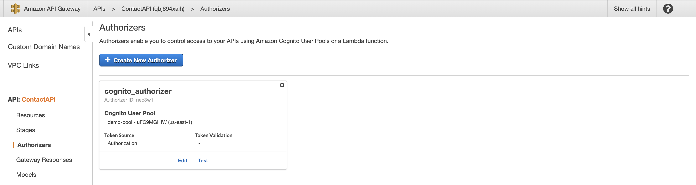

# Configuring Cognito Authorizer

In this section you will setup an **Authorizer** that will enable you to control access to your APIs using Amazon Cognito. This step is needed in order for the API Gateway endpoints to recognize the Cognito idToken being passed to through header to the request.

## Configure API Gateway Authorizer

Go back into the AWS console and search for the API Gateway service. Once you navigate the API Gateway service you should see the following screen.

Click on **ContactAPI** and you should see the following screen.

Next in the panel to the right select **Authorizers**, and you should see the screen below.

You will now click the **Create New Authorizer** button, and the following screen will appear.

Next you will fill in the information to create the **Authorizer**. You can see an example of the information to complete below.

### Authorizer form explanation

- You will start by giving your **Authorizer** a name. In this example we are using the name **_cognito_authorizer_**.

- Since you will be using Cognito as your Authorizer you will select the **Cognito** radio button as the **type**. This will then give you different options to fill in on the form.

- For the **Cognito User Pool** you will select the Cognito User Pool you created at the beginning of the workshop. This will link this **Authorizer** to that **Cognito User Pool**.

  **Note**: The name of your Cognito User Pool will be different, and the name you gave your User Pool when you created it.

- For the **Token Source** you will type the word **Authorization** since the code passes the Cognito idToken through the Authorization header in the request.

- Leave **Token Validation** validation blank. If you wanted you could use a regular expression to validate the token. For the sake of the demo this will be left blank.

- Lastly, you will click **Create**

You should then see the following screen.

## Next Steps

Now that you have setup an **Authorizer** you can configure the API Gateway endpoints to use them. That is what will be covered in the next section.

## [Configuring API Gateway endpoint Authorization](API.md)
