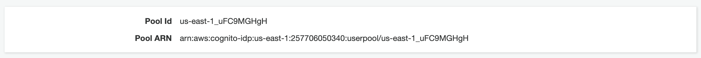
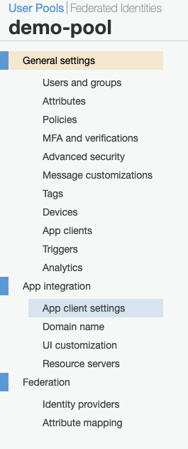
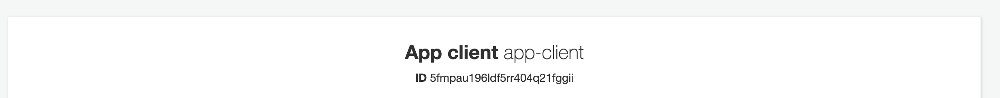
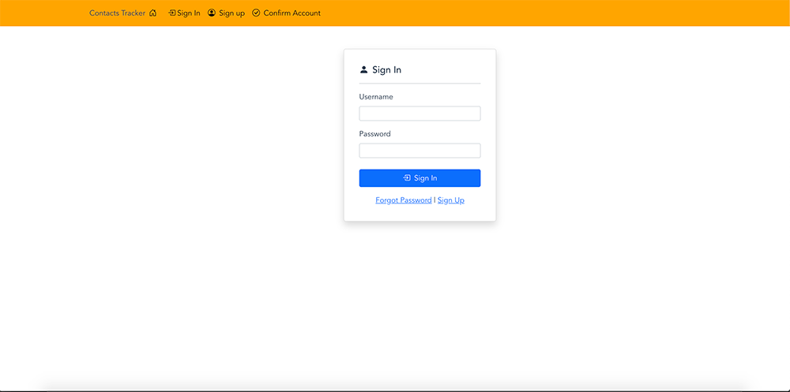

# Configure application to use Cognito User Pool

In this section you will setup the application to communicate with the Cognito User Pool. In order to do this you will need two piece of information about the user pool. You will need the **_Pool ID_** and the **_App Client ID_**. To complete this step you will open the JavaScript file that will use the pool ID and app client ID.

To be configuration open your project code in your favorite text editor editor/IDE. Now navigate to the following JavaScript file **/src/config/cognito.js** in your project.

- The pool ID represents an unique ID that identifies your user pool

You should see the following code in the **/src/config/cognito.js** file.

```js
export const POOL_DATA = {
  UserPoolId: "replace-user-pool-id-here",
  ClientId: "replace-app-client-id-here",
};
```

To get this information you will navigate back to the Cognito User Pool you created.

You should then see your Pool Id. See image below for example.



Now you will copy the Pool Id and paste that in the code where it says:

```js
"replace-user-pool-id-here",
```

Next you will need to navigate to the **_App Client Settings_** in the left-pane menu for your Cognito User Pool.



Now you will copy the ID value. Your ID will be different than what you see in the screen below.



Paste that in the code where it says:

```js
"replace-app-client-id-here",
```

and replace it with your ID value.

## Application Cognito configuration complete

You have now successfully configured your application to communicate with the Cognito User Pool you setup.

## Restarting and testing application

You should now be able to restart your application and view the Sign In screen displayed in the image below.



Next you will start setting up the code to allow users to sign-up for an account, and confirm their account.

## [Coding Sign-In form](SignUp.md)
