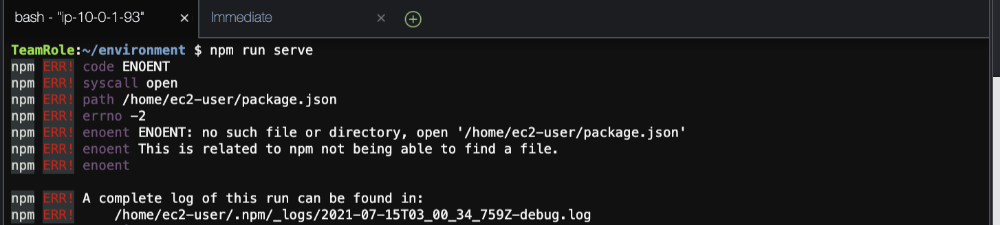

# Configure application to use Cognito User Pool

In this section you will setup the application to communicate with the Cognito User Pool. In order to do this you will need two piece of information about the user pool. You will need the **_Pool ID_** and the **_App Client ID_**. To complete this step you will open the JavaScript file that will use the pool ID and app client ID.

To be configuration open your project code in your favorite text editor editor/IDE. Now navigate to the following JavaScript file **/src/config/cognito.js** in your project.

- The pool ID represents an unique ID that identifies your user pool

You should see the following code in the **/src/config/cognito.js** file.

```js
export const POOL_DATA = {
  UserPoolId: "replace-user-pool-id-here",
  ClientId: "replace-app-client-id-here",
};
```

To get this information you will navigate back to the Cognito User Pool you created.

You should then see your Pool Id. See image below for example.


Now you will copy the Pool Id and paste that in the code where it says:

```js
"replace-user-pool-id-here",
```

Next you will need to navigate to the **_App Client Settings_** in the left-pane menu for your Cognito User Pool.


Now you will copy the ID value. Your ID will be different than what you see in the screen below.


Paste that in the code where it says:

```js
"replace-app-client-id-here",
```

and replace it with your ID value.

## Application Cognito User Pool configuration complete

You have now successfully configured your application to communicate with the Cognito User Pool you setup.

## Testing your application

To test your application you will want to restart your test web server if it not running. See command below to start your development web server.

```shell
npm run serve
```

**Note:** Make sure you are in the correct directory when running the above command or you will receive an error similar to the one seen below.



<!--  -->

To see your application running in the browser click the **_Preview_** tab at the top of the screen, and then select **_Preview Running Application_**. See screenshot below.


Your app may start in bottom of the Cloud9 IDE. See example below of how your application may initially load.


You can expand the application into a new tab by clicking the icon in the corner of your application window. See image below of icon to click to open application in a new browser tab. Click the expand icon to the right of the **Browser** button. This will allow you to test your application in full screen mode.


Once you have expanded the application in a separate browser tab you should see the below application running.


Next you will start setting up the code to allow users to sign-up for an account, and confirm their account.

## [Coding Sign-Up form](SignUp.md)
