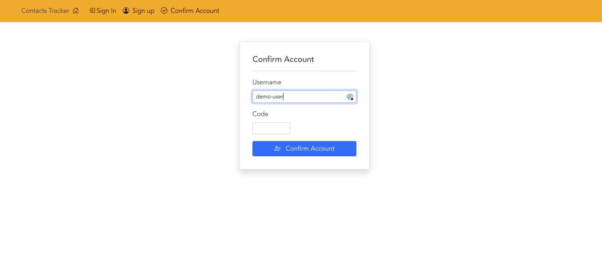
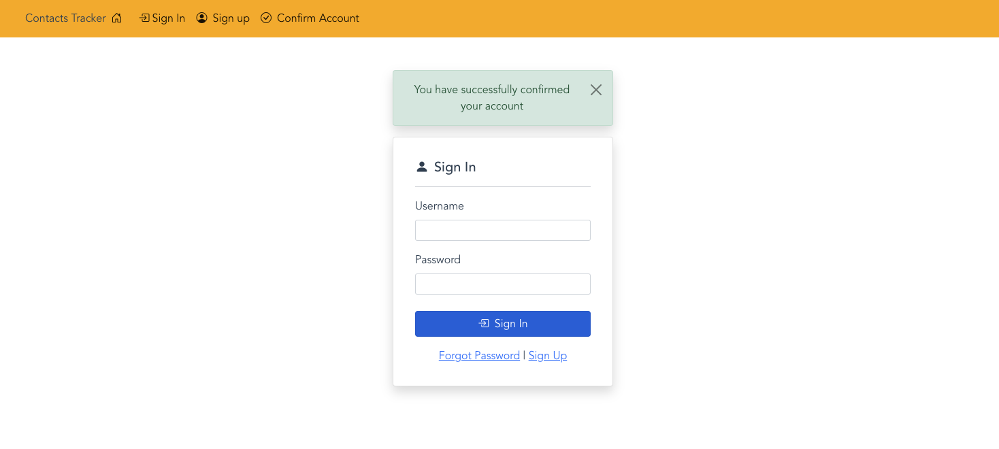

# Confirm Account code setup

In this section you will setup the code that is needed to allow users to confirm a new account after signing up. Once you finish this section a user will be able to confirm their account after signing up for a new account.
## Confirm Account form



## Confirm Account code

```js
/* 
Create a user pool object
The object parameter references the Cognito user pool data held in a constant that we 
setup in the Configure application to use Cognito User Pool section
*/
const userPool = new CognitoUserPool(POOL_DATA);

// creates an object that contains the user pool info and username
const userData = {
    Username: username.value,
    Pool: userPool,
};

/*
creates a Cognito User object and accepts the userData object
*/
const cognitUser = new CognitoUser(userData);
console.log(cognitUser);

/*
calls the Cognito confirm registration method
the method accepts the confirmation code sent to the
users email address used to when signing up
*/
await cognitUser.confirmRegistration(
    code.value,
    true,
    (err, result) => {
    if (err) {
        setMessage(err.message, "alert-danger");
        return;
    }

    console.log(result);

    router.replace({
        name: "SignIn",
        params: {
        message: "You have successfully confirmed your account",
        },
    });
    }
);
```
## Adding code to file

- Next copy the code from the **_Confirm Account code_** section that you reviewed above.
- Now open the following file **_src/components/auth/ConfirmAccountForm.vue_** and locate the code snippet you see below.

```js
//Confirm account code starts here
//paste code here
//Confirm account code ends here
```
## Next Steps
The next step you should take after completing the code for the confirmation page is test the sign up and account confirmation process.

## Milestone 1 - Testing Sign-up and Confirmation process
<ol>
<li>Restart application server if needed.</li>
<li>Navigate to the sign-up page</li>
<li>Sign up for new account</li>
<li>Check email for confirmation code</li>
<li>Go back to confirmation page and enter confirmation code</li>
</ol>

If everything is working correctly you should see the following screen after confirming your account:
