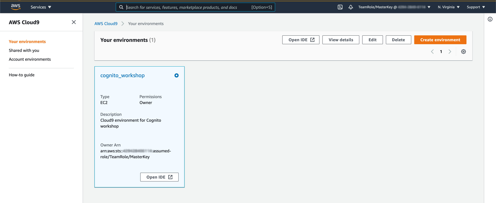
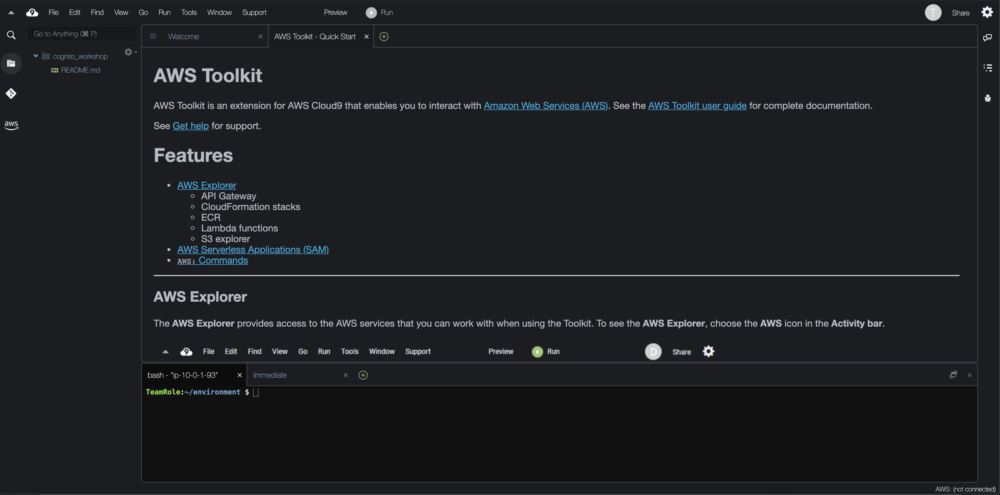
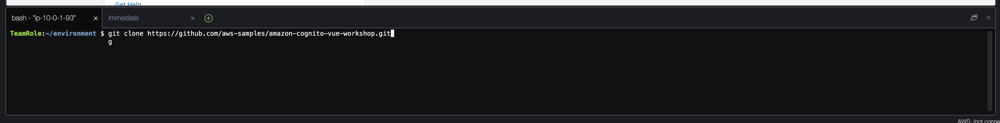
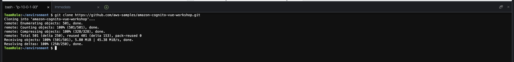
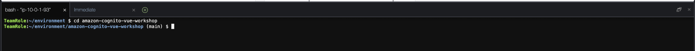
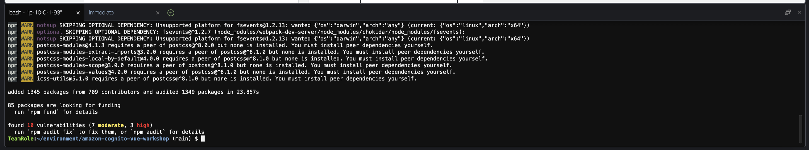
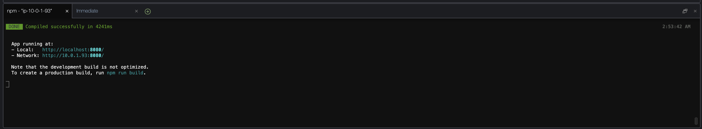

# Accessing Development Environment - (AWS Cloud9)

In this section you will walk-through accessing your development environment, and getting the code to run the workshop

After logging into your Event Engine AWS account you will navigate to the **_AWS Cloud9_** service. You should then see a screen similar to the one below.



Click the **Open IDE** button. It may take a few seconds to load the Cloud9 IDE. Once the Cloud9 IDE loads you should see the screen pictured below.

**Note**: You may have a different theme color.



## Getting workshop code

Next run the following command in your terminal windows at the bottom of the Cloud9 IDE.

```shell
git clone https://github.com/aws-samples/amazon-cognito-vue-workshop.git
```



After you have successfully cloned the code from Github you should see the screen below.



Now that you have the code for the workshop change into the directory that code exist in. You can do this by running the below command in the Cloud9 terminal window.

```shell
cd amazon-cognito-vue-workshop
```

After you have changed directories your terminal should show you in the directory seen in the image below.


You are now in the source code directory. Next you will need to run the command below to load the dependencies needed by project.

```shell
npm install
```

After you have ran the above command you should see a screen similar to the one below.



**Note:** Ignore any warnings that you receive after running the _npm install_ command. For the sake of this workshop we will not focus on any of the dependency libraries that are installed.

Now that you have installed all needed modules to run the workshop you will start the development server. To start the development server run the command below in the Cloud9 terminal window.

```
npm run serve
```

This command will start a development web server to test your code against. After you have run the command above your development web server should be running. Your terminal should display the output you see below.



**Note:** To stop the development web server click into the Cloud9 terminal, and press **control+C** this will stop the development server.

## Next Steps

The next step required to get your application up and running is setup your Cognito User Pool. This is what you will setup in the next section of the of workshop.

## [Cognito User Pool setup](UserPoolSetup.md)
