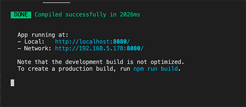

## Getting Workshop Code

You will next get the code to run the workshop by cloning the following Git repo. Run the following command in a preferred location on locally

```
git clone https://github.com/aws-samples/amazon-cognito-vue-workshop
```

You can also download a zip file of the repo here:

https://github.com/aws-samples/amazon-cognito-vue-workshop/archive/refs/heads/main.zip

### Install dependencies

Navigate to where you have cloned the code and run the below command in your terminal or commandline. This will install all the needed node modules to run the application.

```
npm install
```

### Run the project

Run the following command in your terminal or commandline to start the development server.

```
npm run serve
```

You should then see a message similar to the one below:



If you would like to stop the development server press "control+C"

### Current App state

At this time if you navigate to the application URL where it says your **"App running at"**, the page would be blank. The reason is you have not yet setup ***Pool ID*** and the ***App Client ID*** in the config file. This is what you will do in the next section.


<<<<<<< HEAD:docs/2-GettingCode.md
=======

>>>>>>> completed-code:docs/GettingCode.md
