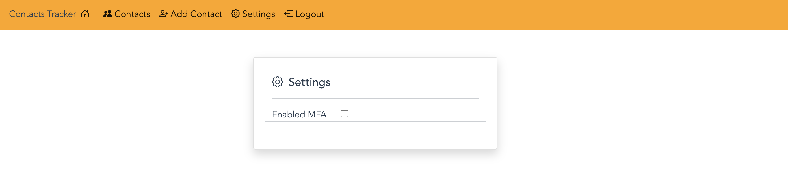
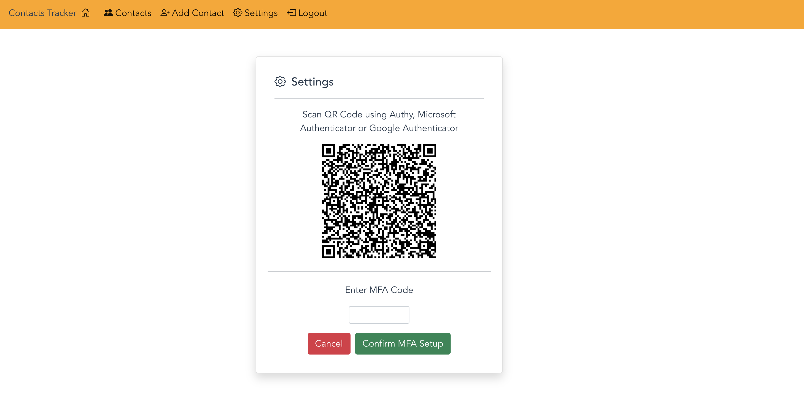

# MFA code setup

In this section you will setup the code that is needed to allow users users to enable MFA on their user accounts.
Once you finish this section a user will be prompted for their MFA code after signing in.

## MFA Forms

Below are screenshots of the forms that will be coded to allow you to enable MFA for a user account.

**Enable MFA form**

This form will allow you to enable MFA by clicking the checkbox that says "Enabled MFA".



**MFA QR Code form**

This form will allow you confirm the MFA Code after scanning it into your MFA application of choice. (Authy, Microsoft Authenticator or Google Authenticator)



## Associate MFA code to authenticator app (Authy, Microsoft Authenticator or Google Authenticator) - code snippet

This section of code associates the MFA code to your MFA app

```js
//gets reference to the Cognito user pool
const userPool = new CognitoUserPool(POOL_DATA);

//gets current logged in user
const cognitoUser = userPool.getCurrentUser();
cognitoUser.setSignInUserSession(store.getters.session);

//creates the image data for QR Code that the user will scan
cognitoUser.associateSoftwareToken({
  onSuccess: function(result) {
    console.log(result);
  },
  associateSecretCode: function(secretCode) {
    qrData.value =
      "otpauth://totp/CognitoMFA:" +
      store.getters.email +
      "?secret=" +
      secretCode +
      "&issuer=CognitoJSPOC";
  },
  onFailure: function(err) {
    console.log(err);
    setMessage("There was a problem generating MFA QR Code.", "alert-danger");
  },
});
```

## Adding code to file

- Next copy the code from the **_Associate MFA code to app_** section that you reviewed above.
- Now open the following file **_src/components/auth/MFASettings.vue_** and locate the code snippet you see below.

```js
//associate Software token code starts here
//paste code here
//associate Software token code ends here
```

- Paste the code where it says **//paste code here**

## Verify MFA Code - code snippet

This section of code associates the MFA code to your MFA app

```js
// gets reference to the Cognito user pool
const userPool = new CognitoUserPool(POOL_DATA);

//gets current logged in user
const cognitoUser = userPool.getCurrentUser();
cognitoUser.setSignInUserSession(store.getters.session);

//verifies the MFA Code and links the Software Token to the users profile
cognitoUser.verifySoftwareToken(qrCode.value, "SoftwareToken", {
  onSuccess: function(result) {
    console.log(result);

    setMFA(true);
    setMessage(
      "MFA has successfully been setup for your account.",
      "alert-success"
    );
    showQRCode.value = false;
  },
  onFailure: function(err) {
    console.log(err);
    setMessage(
      err.message || "There was a problem confirming MFA Code.",
      "alert-danger"
    );
  },
});
```

## Adding code to file

- Next copy the code from the **_Verify MFA code_** section that you reviewed above.
- Now open the following file **_src/components/auth/MFASettings.vue_** and locate the code snippet you see below.

```js
//verify Software token code starts here
//paste code here
//verify Software token code ends here
```

- Paste the code where it says **//paste code here**

## Set user MFA status - code snippet

This section of code enables or disables MFA on a users profile

```js
// gets reference to the Cognito user pool
const userPool = new CognitoUserPool(POOL_DATA);

//gets current logged in user and sets the session
const cognitoUser = userPool.getCurrentUser();
cognitoUser.setSignInUserSession(store.getters.session);

const totpMfaSettings = {
  PreferredMfa: isEnabled,
  Enabled: isEnabled,
};

//sets a users MFA preference
cognitoUser.setUserMfaPreference(null, totpMfaSettings, function(err, result) {
  if (err) {
    console.log(err);
  }

  store.dispatch("setMFA", isEnabled);
  console.log("setUserMfaPreference call result " + result);
});
```

## Adding code to file

- Next copy the code from the **_Set user MFA status_** section that you reviewed above.
- Now open the following file **_src/components/auth/MFASettings.vue_** and locate the code snippet you see below.

```js
//set MFA status value code starts here
//paste code here
//set MFA status value code ends here
```

- Paste the code where it says **//paste code here**

## Milestone 3 - Testing Sign-in with MFA code

The next step you should take after completing the code for the MFA page is test that you can sign in successfully.

<ol>
<li>Restart application server if needed.</li>
<li>Navigate to the MFA page</li>
<li>Sign in with the account you created in the previous section</li>
</ol>

If everything is working correctly you should see the following screen after signing in to your account.

## Next Steps

Next you will setup the Authorizer on API Gateway to allow Cognito to be used as an Authorizer.

## [Configuring Cognito Authorizer](CognitoAuthorizer.md)
