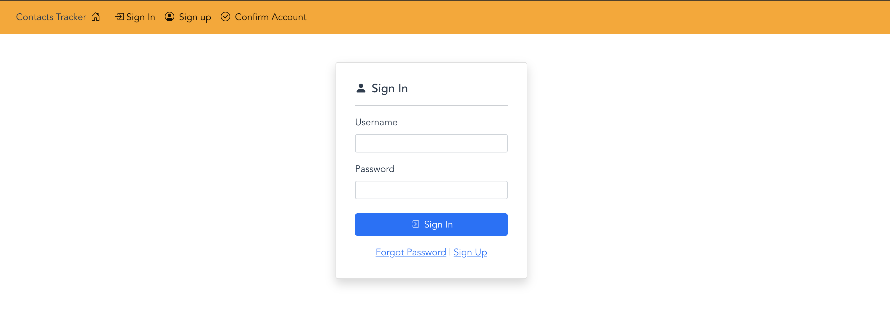
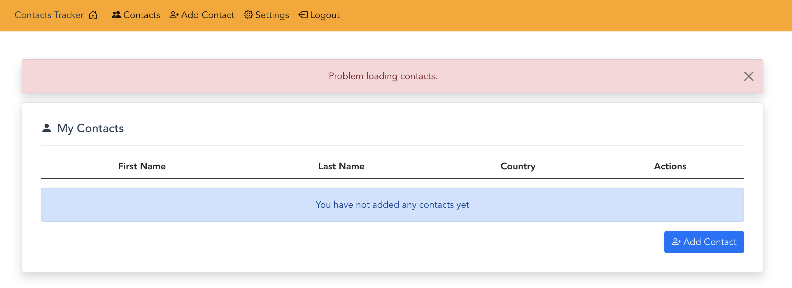

# Sign-in code setup
In this section you will setup the code that is needed to allow users to sign into your application. 
Once you finish this section a user will be able to sign-in with the account they created in the last section.
## Sign-in form



##  Sign-in code

```js
// sets up Cognito User pool data
const userPool = new CognitoUserPool(POOL_DATA);

// sets up Cognito authentication data from sign in form
const authData = {
    Username: username.value,
    Password: password.value,
};

// sets up authentication details - includes username and user pool info
const authDetails = new AuthenticationDetails(authData);
const userData = {
    Username: authData.Username,
    Pool: userPool,
};

// creates a Cognito User object based on user auth details and user pool info
const cognitoUser = new CognitoUser(userData);

//calls the authenticate user method
cognitoUser.authenticateUser(authDetails, {
    onSuccess(session) {
        console.log(session);
        // saves user session info to Vue state system
        setUserSessionInfo(session);

        // after logging in user is navigated to contacts list
        router.replace({
        name: "Contacts",
        params: { message: "You have successfully signed in" },
        });
    },
    onFailure(error) {
        console.log(error);

        // If MFA code is invalid error message is displayed
        if (!error.message.includes("SOFTWARE_TOKEN_MFA_CODE")) {
        setMessage(error.message, "alert-danger");
        }

        store.dispatch("setIsLoading", false);
    },
    totpRequired(codeDeliveryDetails) {
        /* 
        Checks to see if MFA is required
        If MFA is required to complete user authentication.
        this will prompt the user for the MFA code
        */
        confirmMFACode.value = true;
        cognitoUser.sendMFACode(mfaCode.value, this, codeDeliveryDetails);
    },
});
```

## Adding code to file

- Next copy the code from the **_Sign-in code_** section that you reviewed above.
- Now open the following file **_src/components/auth/SignInForm.vue_** and locate the code snippet you see below.

```js
//Sign-in code starts here
//paste code here
//Sign-in code ends here
```

- Paste the sign-in code where is says **//paste code here**

## Milestone 1 - Testing Sign-in 
The next step you should take after completing the code for the sign-in page is test that you can sign in successfully.

<ol>
<li>Restart application server if needed.</li>
<li>Navigate to the sign-in page</li>
<li>Sign in with the account you created in the previous section</li>
</ol>

If everything is working correctly you should see the following screen after signing in to your account.

**Note:** Disregard the error that says, "Problem loading contacts.". You will fix this in a future section of the workshop.


## Next Steps
Next you will code the MFA settings page, so that you can sign in with your account using a MFA code.

## [Coding MFA settings form](MFA.md)

