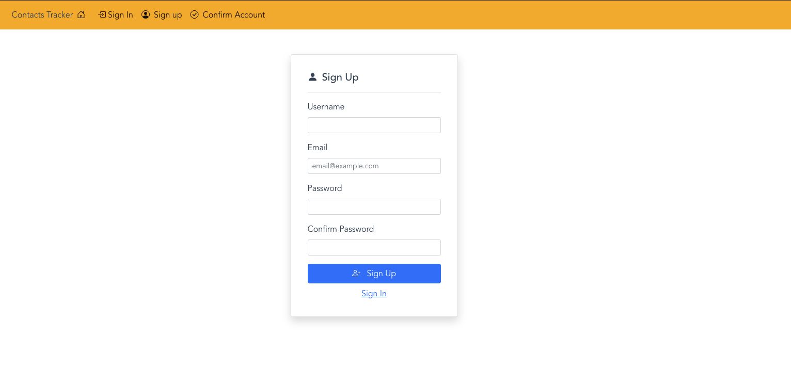

# Sign-up code setup

In this section you will setup the code that is needed to allow users to sign up for a new account in your application. Once you finish this section you will have a completely functioning sign-up form that you see below.

### Sign-up form



## Note: 
Each code section will be commented explaining exactly what it does. 
## Sign-up code

```js
/* 
Create a user pool object. 
The object parameter references the Cognito user pool data held in a constant that we 
setup in the Configure application to use Cognito User Pool section
*/
const userPool = new CognitoUserPool(POOL_DATA);

/*
This array of attributes will be passed to the sign-up method as a parameter. 
In this example we are only passing the email when the user signs up. 
You can pass other attributes such as first name or phone as an example.
*/
const attrList = [];
const emailAttribute = {
  Name: "email",
  Value: email.value,
};

/*
Call the signUp method that is part of the Cognito SDK to interact with User Pool via the SDK
The username, password, and user attribute list are passed as parameters to the method.
*/
attrList.push(new CognitoUserAttribute(emailAttribute));

await userPool.signUp(
  username.value,
  password.value,
  attrList,
  null,
  (err, result) => {
    // If the method calls fails an error message is displayed
    if (err) {
      setMessage(err.message, "alert-danger");
      return;
    }

    console.log(result);

    // If the method calls is successful you are redirected to the Confirm User Form
    router.replace({
      name: "Confirm",
      query: { username: username.value },
    });
  }
);
```

## Adding code to file

- Next copy the code from the **_Sign-up code_** section that you reviewed above.
- Now open the following file **_src/components/auth/SignUpForm.vue_** and locate the code snippet you see below.

```js
//Signup code starts here
//paste code here
//Signup code ends here
```

- Paste the sign-up code where is says **//paste code here**

## Next Steps

Now that you have added the code for the sign-up form you need to allow a user to confirm their account. In the next section you will complete the code for the user to confirm their account.

## [Coding Confirm Account form](ConfirmAccount.md)
