# Cognito User Pool setup

In this section we will walkthrough step-by-step how-to setup a Cognito User Pool. The user pool will be where all of our users will be stored. This will give us the ability to have our users authentication into our application.

To begin setting up your Cognito User Pool navigate to Cognito in the AWS Console. You will then see the Cognito landing page pictured below.

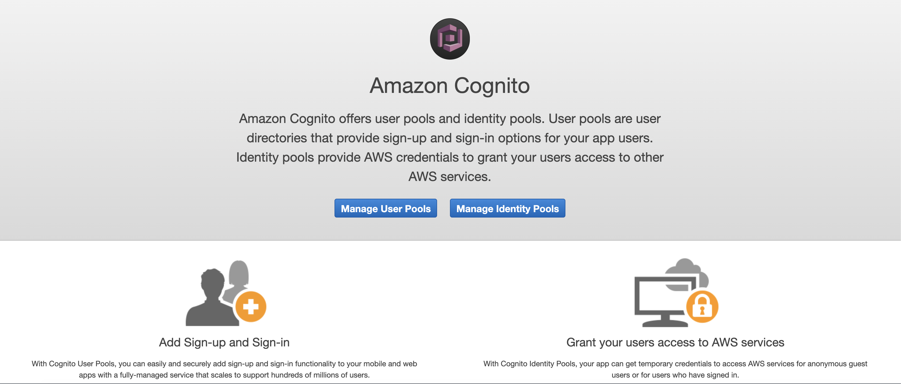

- Click the “Manage User Pools” button. You will then the screen below.
  <image-here>

- Click the “Create a user pool” button and you should see the following screen.

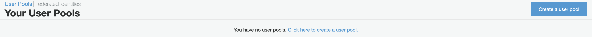

## User pool name

You will then give you user pool a “Pool name”. After you have entered a pool name click the “Step through settings” button.

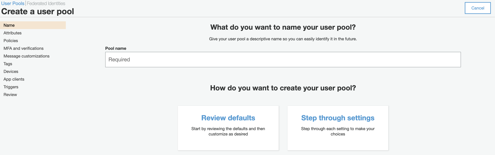

## Attributes

For the user pool attributes select the options that you see in the image below.

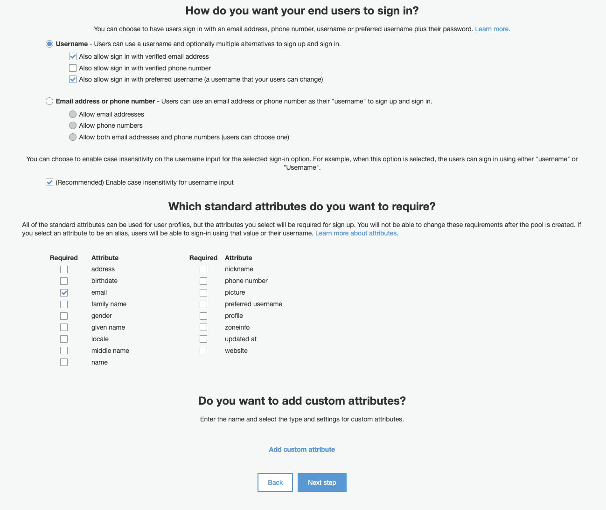

Click the “Next step” button at the bottom of the screen.

## Policies

For the “Policies” you can leave the default values that you see on this screen.

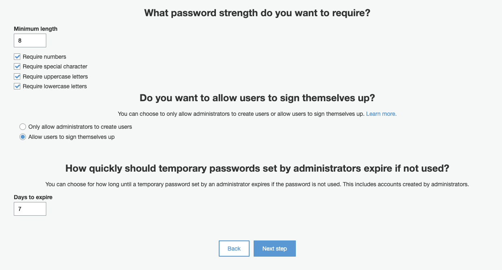

Click the “Next step” button at the bottom of the screen.

## MFA and verifications

For “MFA and verifications” select the options that you see in the screen below.

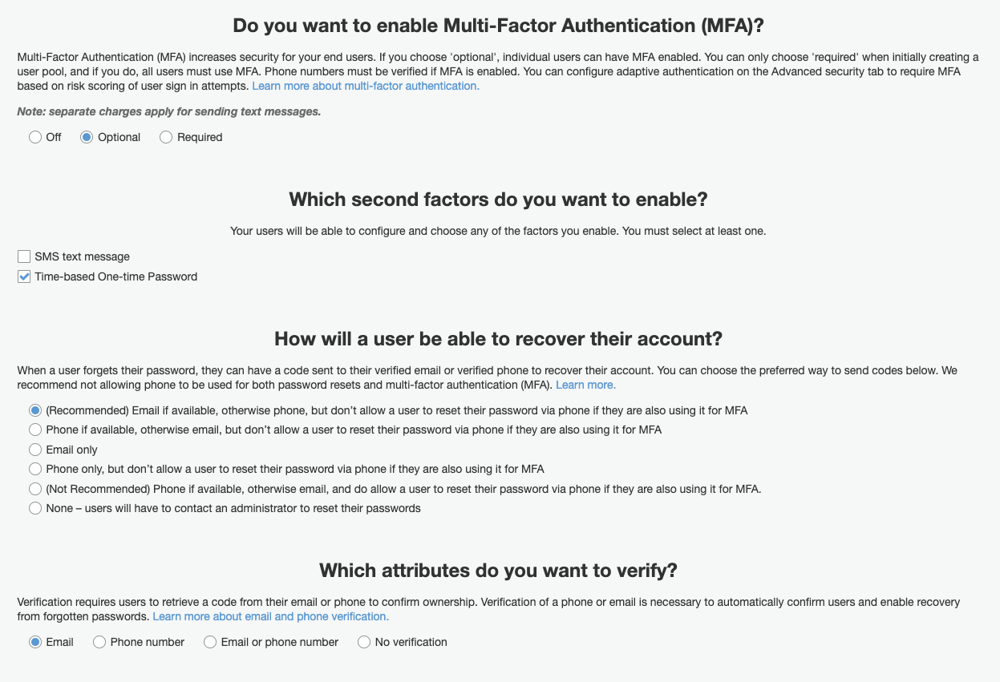

Click the “Next step” button at the bottom of the screen.

## Message customizations

In this workshop we will not be using SES to send out emails. If you wanted to use your own email address to send out emails you could configure SES (Simple Email Service) to accomplish this. For the sake of simplicity, you will leave the below fields blank.

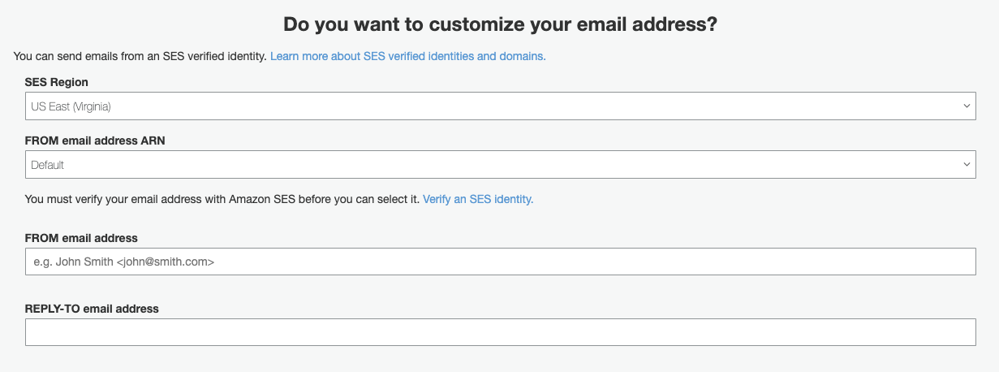

For the other options you see in the image below you can leave the default values. If you would like you can customize your message to your users here. Don’t make changes to the options in brackets since these are placeholders that Cognito uses to dynamically fill in message information such as username and temporary passwords.

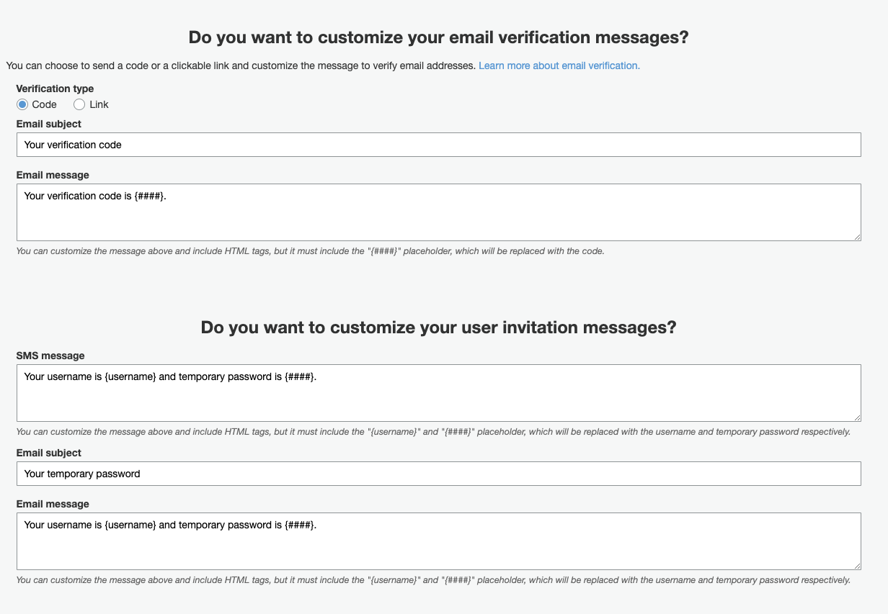

After you have completed this form click the “Next step” button at the bottom of the screen.

## Tags

On the next screen if you would like you can add tags to your user pool. For the workshop we will leave tags black.

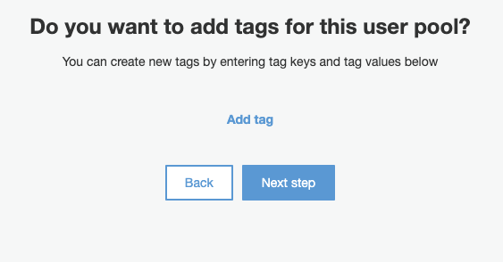

Click the “Next step” button at the bottom of the screen.

## Devices

For the user device options below screen below leave the default value of “No”. If you were building an application where you wanted to track the devices users log in from you can give them the option “User Opt In” or you could always choose to track devices users log in from.

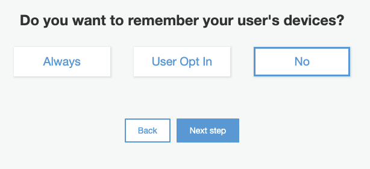

Click the “Next step” button at the bottom of the screen.

## App clients

On the next screen we will setup the app client. By configuring the “app client” we setting up the ability for an application to connect to our user pool. In this workshop we will be connecting to the user pool via the JavaScript SDK. On the screen you see below click the “Add an app client” link.

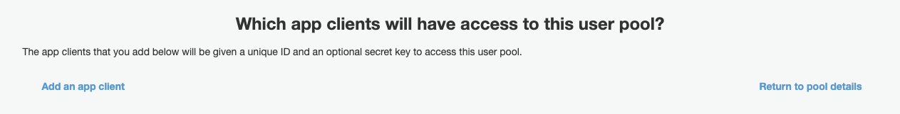

You should then see the following screen.

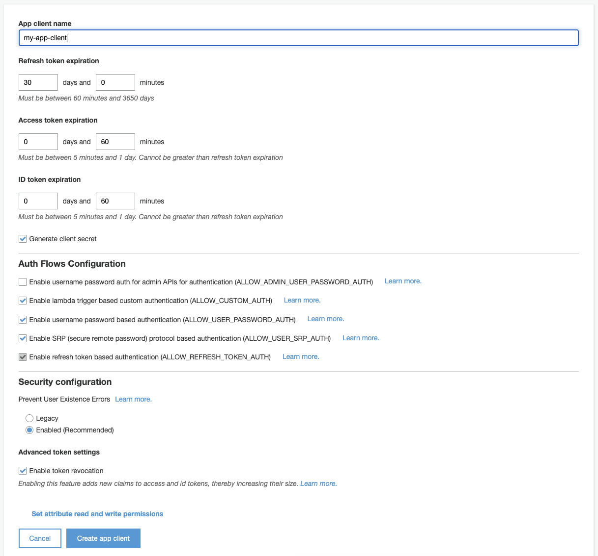

## App client name

You will start giving your app client a name.

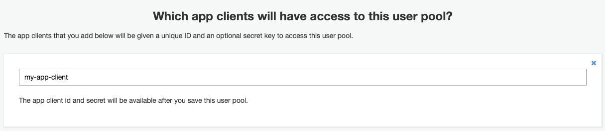

## Token Expiration section

For the Refresh token expiration, Access token expiration, and ID token expiration you leave the default values for the workshop. If you wanted the tokens to expire before the default time-frames you can always come back and make changes.

**_Note_**: Be sure to uncheck "Generate client secret". Since we are running our code on the client-side we will not sure this option. If our code was running in server-side where users wouldn't have access to view our code we could use this option.

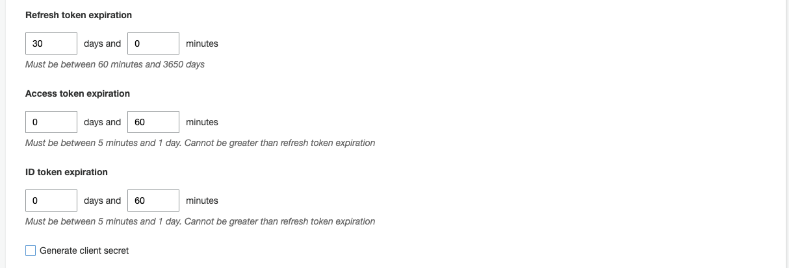

Next click the "Create app client" button.

## Auth Flows Configuration section

For the auth flow settings be sure you select the third checkbox option, “Enable username password-based authentication (ALLOW_USER_PASSWORD_AUTH)”

This setting allows user to log into your Cognito user pool via username and password. If this option is not selected you will receive an error when you code call the authentication method.

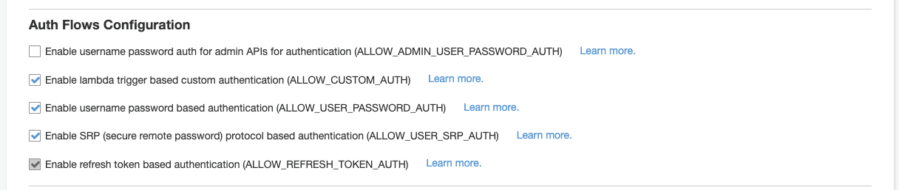

## Security Configuration

For this section you will leave the default value.

Finally click the **_“Create app client”_** button before click the “Next step” button. After your app client has been create click the “Next step” button.
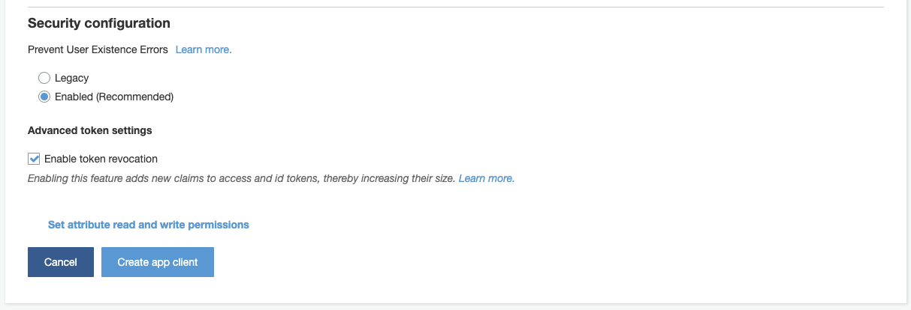

## Finalize App Client

You will now see the following screen after you have created your app client. Click the "Next step" button.
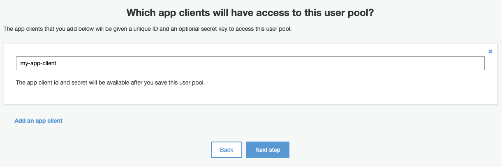

## Triggers

For the triggers we will not be using them for this workshop. If you needed to add things custom logic for pre-authentication, pre-signup, post authentication, or post account confirmation you would configure those triggers here to initiate lambda functions.

A good example of taking advantage Cognito triggers are after a user confirms their account you could have default user settings record created in a backend database.

Since you will not be using triggers in this workshop you can click the “Next step” button at the bottom of the screen.

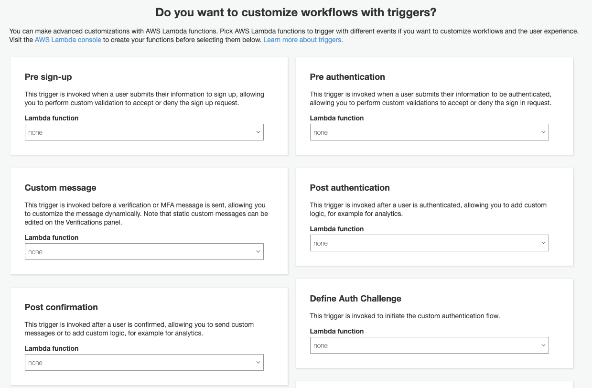

## Review

You should now see a screen similar to the image below with the “Pool name”, and the options that you select as you configured the user pool. Once you are satisfied with the options you have selected for your user pool click the “create pool” button.

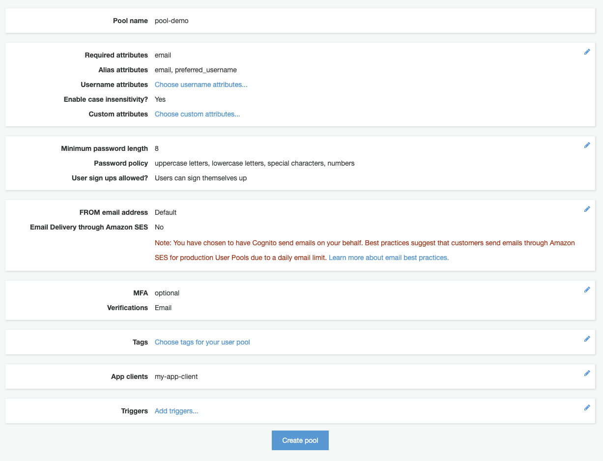

Once your user pool has successfully been created you will see a screen similar the image below.

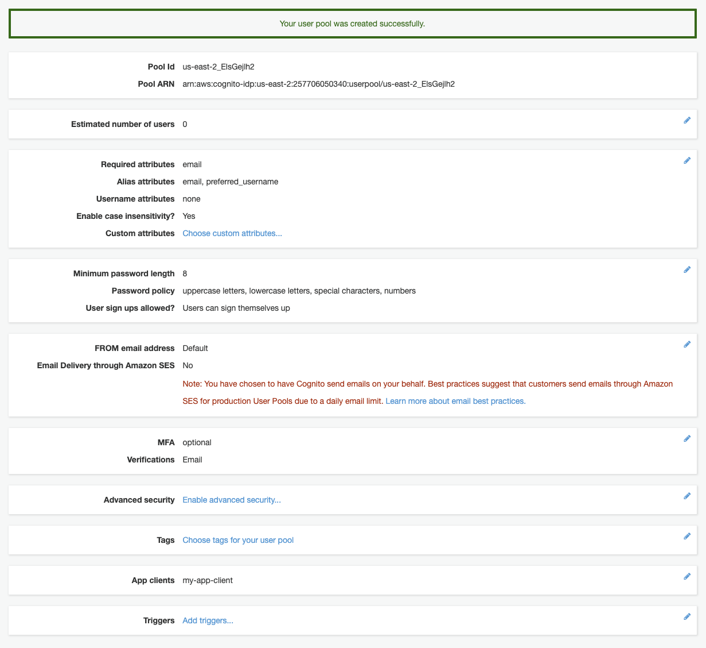

Now that you have setup your Cognito User Pool you will configure your application to use the user pool.

## [Configure application to use Cognito User Pool](CognitoConfig.md)
